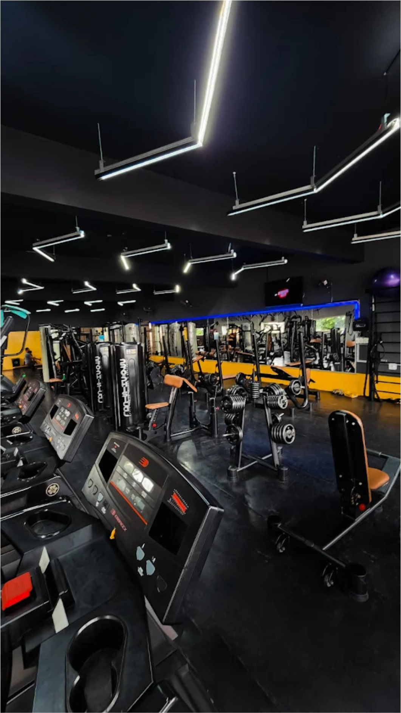

# Academia Multfitness - Guia de Implementação

## 📋 Estrutura de Arquivos

```
Multfitness/
├── index.html
├── style.css
├── assets/
│   ├── favicon.svg (ícone do site)
│   └── img/
│       ├── 1.svg (Área de musculação)
│       ├── 2.svg (Escada ergométrica)
│       ├── 3.svg (Bikes e spinning)
│       ├── 4.svg (Esteiras)
│       ├── 5.svg (Visão geral)
│       └── headbanner.svg (Hero banner fullscreen)
```

## 🖼️ Substituição de Imagens

O site utiliza arquivos SVG como placeholders. Para colocar as suas imagens reais:

### 1. **Para o Hero Banner Fullscreen**
- Substitua `assets/img/headbanner.svg` por sua imagem em PNG ou JPG
- A imagem será exibida em fullscreen (100vh) com overlay escuro
- Dimensão recomendada: 1920x1080px ou maior
- Certifique-se de que a imagem tem boa qualidade

**No arquivo `style.css` (linha da classe `.hero-banner`):**
```css
background: linear-gradient(135deg, rgba(0, 0, 0, 0.6) 0%, rgba(0, 0, 0, 0.4) 60%, transparent 100%), 
            url('./assets/img/headbanner.png') center/cover no-repeat;
```

### 2. **Para o Slider de 5 Imagens**
Substitua os arquivos SVG pelos arquivos reais:
- `assets/img/1.jpg` - Área de musculação
- `assets/img/2.jpg` - Escada ergométrica
- `assets/img/3.jpg` - Bikes e spinning
- `assets/img/4.jpg` - Esteiras
- `assets/img/5.jpg` - Visão geral do espaço

**No arquivo `index.html` (seção Estrutura / Slider):**
```html
<div class="slide fade">
    
</div>
```

### 3. **Para o Favicon**
Substitua `assets/favicon.svg` por `assets/favicon.png`:

**No arquivo `index.html` (head):**
```html
<link rel="icon" type="image/png" href="./assets/favicon.png">
```

---

## 🎨 Especificações de Imagem

### Hero Banner
- **Dimensões**: 1920x1080px (mínimo) ou maior
- **Formato**: PNG, JPG ou WebP
- **Peso**: < 2MB (otimizado)
- **Conteúdo**: Foto do casal/pessoas em ação, treino intenso
- **Foco**: Centralizado para manter foco visual

### Slider (5 Imagens)
- **Dimensões**: 1200x800px ou proporcional
- **Formato**: PNG, JPG ou WebP
- **Peso**: < 1MB cada (otimizado)
- **Proporção**: 16:10 ou similar

---

## ⚡ Otimizações Recomendadas

1. **Comprimir imagens**: Use ferramentas como TinyPNG ou ImageOptim
2. **Usar WebP**: Formato mais moderno e leve que JPG
3. **Lazy Loading**: Já está implementado no HTML para melhor performance
4. **Responsividade**: Imagens se adaptam automaticamente a mobile e desktop

---

## 🚀 Funcionalidades do Slider

✅ **Navegação com Setas**: Botões laterais para próxima/anterior  
✅ **Dots Indicadores**: 5 pontos interativos na parte inferior  
✅ **Autoplay**: Muda automaticamente a cada 5 segundos  
✅ **Pause ao Hover**: Pausa o autoplay quando o mouse passa  
✅ **Swipe no Mobile**: Deslize para navegar em tela sensível  
✅ **Transições Suaves**: Efeito fade elegante entre imagens  
✅ **Zoom ao Hover**: Pequeno efeito de zoom na imagem

---

## 📱 Responsividade

- **Desktop**: Slider com altura máxima de 80vh
- **Tablet**: Ajusta proporções e botões
- **Mobile**: Altura reduzida, botões maiores para toque

---

## 🔍 SEO

- Alt text descritivo em todas as imagens
- Favicon para branding
- Meta tags no head
- Estrutura semântica HTML5

---

## 💡 Dicas Adicionais

1. **Backup**: Guarde os arquivos SVG como fallback
2. **Teste**: Verifique em diferentes navegadores
3. **Velocidade**: Use `WebP` para melhor compressão
4. **Acessibilidade**: Mantenha alt text descritivo

---

Para dúvidas ou ajustes, consulte a documentação do projeto ou entre em contato!
